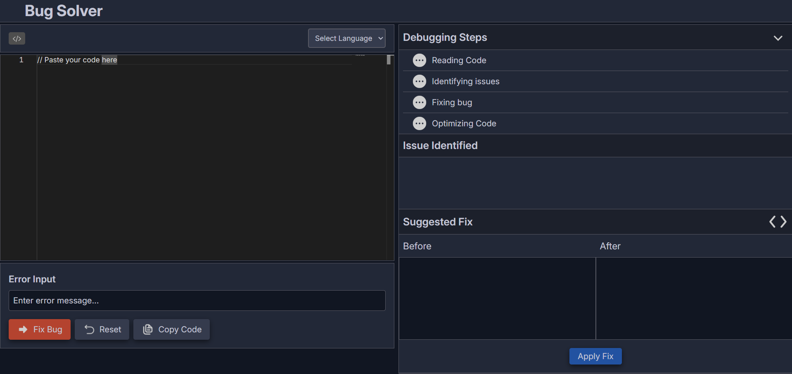

# Bug Solver (AI-Powered Debugging Tool)
Bug Solver helps developers find and fix code errors using AI-powered debugging. It analyzes buggy code, provides optimized fixes with simple explanations, and lets users instantly run the AI-fixed code to verify the solution.

### Live Demo
https://bug-solver.vercel.app/

### Preview

### Features
- AI Bug Detection & Fixing – Detects code errors and provides AI-generated fixes using Google Gemini API.
- Code Execution – Run the AI-fixed code instantly to verify the output using Judge0.
- Interactive Code Editor – Smooth coding experience with syntax highlighting powered by Monaco Editor.
- Simple Explanations – Understand the bug and solution with beginner-friendly explanations.

### Tech Stack
- React.js
- Tailwind CSS
- Gemini AI API
- Vercel Serverless Functions
- Monaco Editor
- Judge0

### What I Learned
- Integrating AI APIs like Google Gemini API into a real-world application.
- Working with Monaco Editor to build an interactive code editor experience.
- Using Judge0 for real-time code execution and validation.
- Improving API handling, debugging skills.
